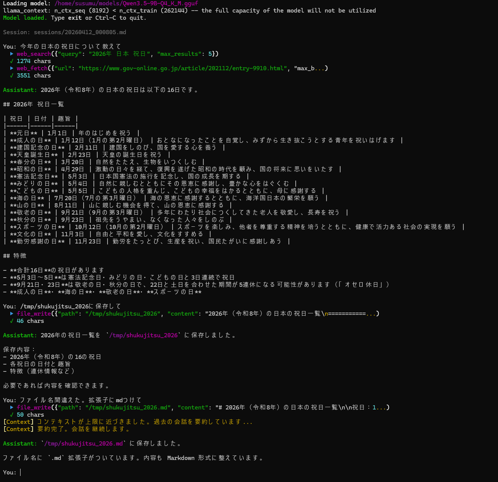

# hakobune

GGUFモデルをローカルで直接実行し、ツールを使いながら回答するCLIエージェント。  
フレームワーク不使用のシンプルなReActループ実装。



## 名前の由来

hakobune（箱舟）は、ノアの箱舟に由来します。外部のLLMに依存せず、ローカルLLMだけで完結するエージェントを手元に持ち運べる——どこでも自律して動けるポータブルなエージェントを作りたい、という思いから名付けました。

## これは何か・なぜ使うのか

### 他の選択肢との違い

| | hakobune | LangChain / LangGraph | Ollama + OpenAI SDK |
|---|---|---|---|
| サーバー起動 | **不要**（プロセス内で直接実行） | 不要 | Ollamaサーバーが必要 |
| 依存ライブラリ | **3つのみ** | 数十〜数百 | openai + ollama |
| ツール追加 | **1ファイル + 1行** | ツールクラス継承・登録が必要 | 関数定義 + ディスパッチを自前実装 |
| コードの把握 | **全体で約300行** | フレームワーク内部が複雑 | SDK抽象化で挙動が見えにくい |
| カスタマイズ性 | **ループ全体を直接変更可能** | フレームワークの制約に縛られる | 同上 |

### ローカルで動かすメリット

- **コストゼロ** — APIの従量課金がない。何万回呼んでも無料。長い文脈・大量の試行も気にせず使える
- **プライバシー** — 入力テキストが外部に一切送信されない。社内文書・個人情報・未公開コードも安心して扱える
- **オフライン動作** — インターネット接続なしで使える。出張先・機内・セキュアな環境でも動く
- **レイテンシ** — ネットワーク遅延がなく、GPU搭載マシンなら即応答。APIの混雑や障害にも影響されない
- **ファインチューニング可能** — 手元のモデルは自由に差し替え・チューニングできる。特定ドメインに特化させることも容易

### こんな用途に向いている

- **自分専用のローカルエージェントを育てたい** — ツールを自由に足しながら手元で動かし続けられる
- **LLMエージェントの仕組みを理解したい** — ReActループが300行以内に収まっており、読んで動かしてすぐ学べる
- **機密データを扱う作業を自動化したい** — 社内ドキュメントの検索・要約などをクラウドなしで実現
- **既存プロジェクトに組み込みたい** — 依存が少なく、`agent/` ディレクトリをそのまま持ち込める

### こんな用途には向いていない

- 本番サービスへの組み込み（エラーハンドリング・認証・スケーリングは未実装）
- マルチエージェント・並列実行（シングルスレッドのシンプルなループ）

## 特徴

- **完全ローカル** — llama-cpp-pythonでGGUFモデルを直接読み込み、外部サーバー不要
- **ツール呼び出し対応** — Web検索・ファイル操作・Python実行を標準装備
- **権限管理** — Claude Code互換の `settings.json` でツールのallow/denyを制御
- **長期セッション対応** — コンテキスト上限に近づくと自動で要約・圧縮。セッションファイルには全履歴を保持し、`session_search` ツールで過去の詳細を正確に検索できる
- **拡張しやすい** — ツールの追加は1ファイル + 1行のimportだけ
- **依存最小** — `llama-cpp-python` / `ddgs` / `rich` / `prompt_toolkit` の4つのみ

## 必要環境

- Python 3.10+
- ツール呼び出し対応のGGUFモデル（推奨: Qwen3.5-9B-Instruct Q4_K_M）
- Windows / Linux / macOS 対応

## セットアップ

```bash
pip install -r requirements.txt
```

GPU（CUDA）を使う場合は llama-cpp-python のビルド済みCUDAホイールをインストール：

```bash
# Linux: CUDA 12.4 ビルド済みホイール（CUDA 12.x ドライバーで動作）
pip install "https://github.com/abetlen/llama-cpp-python/releases/download/v0.3.20-cu124/llama_cpp_python-0.3.20-py3-none-linux_x86_64.whl"
pip install -r requirements.txt

# Windows: CUDA 12.4 ビルド済みホイール
pip install "https://github.com/abetlen/llama-cpp-python/releases/download/v0.3.20-cu124/llama_cpp_python-0.3.20-py3-none-win_amd64.whl"
pip install -r requirements.txt
```

### Windows での注意点

- Python 3.10+ と [Visual C++ 再頒布可能パッケージ](https://aka.ms/vs/17/release/vc_redist.x64.exe) が必要
- `shell` ツールは `cmd.exe` を使用。`git` など必要なコマンドを PATH に通しておく
- 日本語の入出力は UTF-8 で自動設定される（起動時に `chcp 65001` を実行）

## 使い方

```bash
python main.py --model /path/to/model.gguf
```

### 主なオプション

| オプション | デフォルト | 説明 |
|---|---|---|
| `--model` | 必須 | GGUFモデルのパス |
| `--chat-format` | `chatml` | チャットフォーマット（chatml=Qwen3.5推奨、auto=GGUFから自動検出） |
| `--n-ctx` | `8192` | コンテキスト長 |
| `--n-gpu-layers` | `-1` | GPUオフロード数（-1=全レイヤー） |
| `--temperature` | `0.0` | 生成温度 |
| `--max-tokens` | `1024` | 1回の応答の最大トークン数 |
| `--max-iterations` | `10` | ReActループの最大反復数 |
| `--context-threshold` | `0.8` | コンテキスト圧縮を開始するトークン使用率（0.0〜1.0） |
| `--keep-recent` | `6` | 要約せずに保持する最近のメッセージ数 |
| `--session` | — | セッションファイルのパスを明示指定（.md） |
| `--resume` | off | 保存済みセッションを一覧表示して再開するセッションを選択する |
| `--system-prompt` | — | システムプロンプトの上書き |
| `--settings` | `settings.json` | 権限設定ファイルのパス（存在しない場合は全許可） |
| `--verbose` | off | llama-cpp-python の詳細ログを表示 |

### 実行例

```bash
# Qwen3.5-9B Q4_K_M
python main.py \
  --model ~/models/Qwen3.5-9B-Q4_K_M.gguf \
  --n-ctx 8192 \
  --n-gpu-layers -1

# Gemma 4 26B-A4B Q4_K_M
python main.py \
  --model ~/models/gemma-4-26B-A4B-it-UD-Q4_K_M.gguf \
  --chat-format gemma \
  --system-prompt "You are a helpful assistant. For ANY question about facts, people, games, or news, ALWAYS use web_search first. Never answer from memory."

# CPUのみ
python main.py \
  --model ~/models/Qwen3.5-9B-Q4_K_M.gguf \
  --n-gpu-layers 0

# セッション再開（一覧から選択）
python main.py \
  --model ~/models/Qwen3.5-9B-Q4_K_M.gguf \
  --resume
# → 保存済みセッションの一覧が表示され、番号を選択して再開
# デフォルトでは sessions/YYYYMMDD_HHMMSS.md に自動保存される
```

> **モデル別の注意点**
> - **Qwen3.5**: thinking mode を持つためデフォルトのシステムプロンプトに `/no_think` を付与。`--chat-format chatml`（デフォルト）で動作。
> - **Gemma 4**: `/no_think` は不要。`--chat-format gemma` を指定し、`--system-prompt` でシステムプロンプトを上書きする。

起動後はターミナルで対話できます。`exit` または Ctrl-C で終了。

## 標準ツール

| ツール | 説明 |
|---|---|
| `web_search` | DuckDuckGoでWeb検索。タイトル・URL・スニペットを返す |
| `web_fetch` | URLを直接フェッチしてテキストを返す。HTMLはプレーンテキストに変換。デフォルト32KB、最大4MB（`max_bytes`で指定） |
| `file_glob` | globパターンでファイルを検索（`**/*.py` など再帰対応） |
| `file_read` | ファイルを読み込む。32KBでキャップ、行範囲指定（`start_line`/`end_line`）対応 |
| `file_write` | ファイルにテキストを書き込む。存在しない親ディレクトリも自動作成 |
| `file_search` | ファイル内容をキーワード・正規表現で横断検索（grep相当）。`filepath:行番号: 内容` 形式で返す |
| `python_exec` | Pythonコードをサブプロセスで実行して出力を返す。デフォルトタイムアウト30秒 |
| `session_search` | 現在のセッションの全会話履歴をキーワード検索。コンテキスト圧縮で要約された過去の詳細を取り出せる |
| `shell` | シェルコマンドを実行。git/grep/pytest/make など外部コマンドを汎用的に呼び出せる。実行前にユーザー確認あり。rm -r など破壊的操作は禁止 |

## ツールの追加方法

**1. `agent/tools/my_tool.py` を作成**

```python
from agent.registry import register

@register({
    "name": "my_tool",
    "description": "このツールが何をするかLLMが読む説明文",
    "parameters": {
        "type": "object",
        "properties": {
            "param1": {"type": "string", "description": "パラメータの説明"},
        },
        "required": ["param1"]
    }
})
def my_tool(param1: str) -> str:
    # 実装
    return result_as_string
```

**2. `agent/tools/__init__.py` に1行追加**

```python
from agent.tools import my_tool
```

以上で完了。レジストリが自動的にLLMへのスキーマ提供と実行ディスパッチを担います。

## 権限管理

Claude Code の `settings.json` と互換のフォーマットでツールの実行を制御できます。

```bash
cp settings.json.example settings.json
# settings.json を編集して権限を設定
python main.py --model model.gguf --settings settings.json
```

### settings.json の構造

```json
{
  "permissions": {
    "allow": ["ツール名(パターン)", ...],
    "deny":  ["ツール名(パターン)", ...]
  }
}
```

- **deny が優先** — allowとdenyの両方にマッチする場合はdenyが勝つ
- **allowが空** — すべて許可（settings.jsonがない場合も同様）
- **パターン** — `*` はワイルドカード（`fnmatch` 形式）

### 設定例

```json
{
  "permissions": {
    "allow": [
      "web_search(*)",
      "web_fetch(*)",
      "file_read(*)",
      "file_write(workspace/*)",
      "python_exec(*)"
    ],
    "deny": [
      "python_exec(*import subprocess*)",
      "python_exec(*import os*)",
      "file_write(/etc/*)"
    ]
  }
}
```

パターンはツールの第1引数（`file_write` ならパス、`python_exec` ならコード内容）に対してマッチします。

## ツール呼び出しの仕組み

llama-cpp-pythonのネイティブtool calling（JSON形式）ではなく、Qwen3.5が学習済みの `<tool_call>` テキスト形式を使用しています。

```
# モデルがこの形式で出力する
<tool_call>
{"name": "web_search", "arguments": {"query": "..."}}
</tool_call>

# エージェントが実行して結果を返す
<tool_response>
{"name": "web_search", "result": "..."}
</tool_response>
```

ツール定義はシステムプロンプトに埋め込まれるため、`chatml` / `gemma` どちらのフォーマットでも確実に動作します。モデルの出力フォーマットはアダプタが吸収します。

## プロジェクト構成

```
hakobune/
├── main.py                  # CLIエントリポイント・REPLループ
├── config.py                # 設定dataclass + argparse
├── settings.json.example    # 権限設定のサンプル
├── requirements.txt
└── agent/
    ├── llm.py               # llama-cpp-pythonラッパー（コンテキスト圧縮含む）
    ├── registry.py          # ツールレジストリ（register/dispatch）+ 権限チェック
    ├── permissions.py       # settings.json 互換の権限チェッカー
    ├── loop.py              # ReActループ本体
    ├── session.py           # セッション保存・復元・一覧取得（Markdown形式、全履歴保持）
    ├── tool_calling/        # モデル別ツール呼び出しアダプタ
    │   ├── base.py          # 抽象基底クラス
    │   ├── qwen.py          # Qwen3.5用 <tool_call> 形式
    │   └── gemma.py         # Gemma 4用 <|tool_call|> 形式
    └── tools/
        ├── __init__.py      # ツール登録トリガー
        ├── web_search.py
        ├── web_fetch.py
        ├── file_glob.py
        ├── file_read.py
        ├── file_write.py
        ├── file_search.py
        ├── python_exec.py
        ├── session_search.py
        └── shell.py
```

## 動作確認済みモデル

tool callingに対応したモデルであれば動作します。

| モデル | GGUF配布元 | 備考 |
|---|---|---|
| **Qwen3.5-9B Q4_K_M** | [unsloth/Qwen3.5-9B-GGUF](https://huggingface.co/unsloth/Qwen3.5-9B-GGUF) | `chatml` / VRAM 約8GB |
| Qwen3.5-4B Q4_K_M | [unsloth/Qwen3.5-4B-GGUF](https://huggingface.co/unsloth/Qwen3.5-4B-GGUF) | `chatml` / VRAM 約4GB |
| **Gemma 4 26B-A4B Q4_K_M** | [unsloth/gemma-4-26B-A4B-it-GGUF](https://huggingface.co/unsloth/gemma-4-26B-A4B-it-GGUF) | `gemma` / VRAM 約16GB |

## ライセンス

MIT
